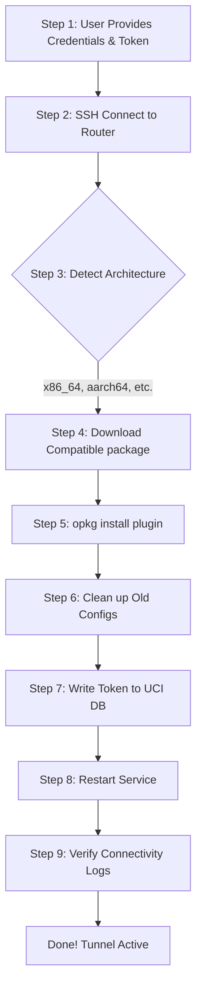

# Cloudflare Tunnel on iStoreOS Configurator

[🇨🇳 简体中文](README_zh.md) | [🇺🇸 English](README.md)

Simplify and automate the process of setting up **Cloudflare Tunnel (cloudflared)** on iStoreOS or OpenWRT routers. This package contains an AI agent skill that can handle zero-trust deployment from start to finish, **including automatically downloading and installing the required packages.**

> **Tags / Topics:** `cloudflare-tunnel`, `istoreos`, `openwrt`, `ai-agent`, `skill`, `zero-trust`, `automation`, `cursor-rules`, `skillsmp`, `cloudflared`

## Automation Workflow



## Detailed Execution Steps

This repository is designed so that an AI Agent (like Cursor / Antigravity) running `SKILL.md` or a human following manual commands can execute the exact same predictable flow:

### Step 1 & 2: Get Credentials and Connect
You provide the router IP (`192.168.1.1`), SSH username/password, and your Cloudflare Tunnel Token (`eyJh...`). The Agent logs into your OpenWRT/iStoreOS router via SSH (`ssh root@ip`).

### Step 3: Architecture Detection
The script or agent runs `uname -m` to figure out the exact CPU architecture (e.g., `x86_64` or `aarch64`) so the correct file can be downloaded.

### Step 4 & 5: Download & Install Package
The correct URL is constructed for the `downloads.openwrt.org` server. The `ipk` file is downloaded to `/tmp` via `wget` and installed using `opkg`.
```bash
cd /tmp
# Agent automatically fills the architecture and version here:
wget https://downloads.openwrt.org/releases/24.10.5/packages/x86_64/packages/cloudflared_2025.5.0-r1_x86_64.ipk
opkg install cloudflared_2025.5.0-r1_x86_64.ipk
```

### Step 6: Clean Environment
To avoid conflicting legacy files, the script stops the service, purges old configuration files, and explicitly recreates the necessary configuration directory (`/etc/cloudflared`).
```bash
/etc/init.d/cloudflared stop
rm -rf /etc/config/cloudflared /etc/cloudflared
mkdir -p /etc/cloudflared
```

### Step 7: Write Token via UCI
OpenWRT relies on the Unified Configuration Interface (UCI). The user's Token is injected into the database directly.
```bash
# YOUR_TOKEN_HERE is swapped out automatically
uci set cloudflared.config.token='YOUR_TOKEN_HERE'
uci set cloudflared.config.enabled='1'
uci commit cloudflared
```

### Step 8: Restart Service
The service is enabled for auto-boot and restarted to apply the new credentials.
```bash
/etc/init.d/cloudflared enable
/etc/init.d/cloudflared restart
```

### Step 9: Verify Connectivity Logs
The agent checks `/var/log/cloudflared.log` to prove to the user that Cloudflare's Edge network accepted the connection (`Registered tunnel connection`).
```bash
tail -n 20 /var/log/cloudflared.log
```

## How to use

### For AI Agents (`SKILL.md`)
Import `SKILL.md` into your agent. Just provide the instructions:
> *"Install my cloudflare tunnel on my iStoreOS router at 192.168.1.1. My token is eyJh..."*

The AI will handle Steps 1 through 9 entirely automatically.

### Manual Setup
Simply run the bash snippets provided in **Steps 4 through 9** sequentially in your router's SSH console.

## License
MIT License
