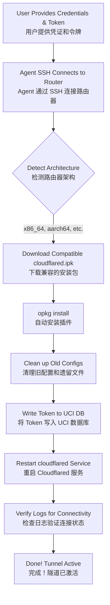

# Cloudflare Tunnel on iStoreOS Configurator (iStoreOS 上的 Cloudflare Tunnel 自动化配置器)

Simplify and automate the process of setting up **Cloudflare Tunnel (cloudflared)** on iStoreOS or OpenWRT routers. This package contains an AI agent skill that can handle zero-trust deployment from start to finish, **including downloading and installing the required packages automatically.**

简化和完全自动化在 **iStoreOS** 或 **OpenWRT** 路由器上设置 **Cloudflare Tunnel (cloudflared)** 的过程。此包包含一个 AI 智能体（Agent）技能，可以全程处理零信任部署，**包括自动下载和安装所需的软件包。**

## Automation Workflow (自动化执行流程图)



## What is this? (这是什么？)
Often, users want to deploy the `cloudflared` extension on OpenWRT/iStoreOS but struggle with finding the right architecture package (`.ipk`), command-line setup, SSL validation issues, or UCI configuration. This skill (designed for AI agents like Antigravity/Cursor/Devin) allows the AI to automatically SSH into the router, **detect the architecture, download the latest compatible `cloudflared.ipk`, install it**, configure the CF Tunnel token, establish the remote connection, and troubleshoot common issues like HTTP 503 errors.

用户经常希望在 OpenWRT/iStoreOS 上部署 `cloudflared` 扩展，但在查找正确的架构包 (`.ipk`)、命令行设置、SSL 验证问题或 UCI 配置方面遇到困难。此技能（专为 Antigravity/Cursor/Devin 等 AI Agent 设计）允许 AI 自动 SSH 连接到路由器，**检测架构，下载最新兼容的 `cloudflared.ipk` 并安装它**，配置 CF Tunnel 令牌，建立远程连接，并排查常见的如 HTTP 503 错误等问题。

## Configured Files & Paths (配置文件详解)

This skill modifies the core OpenWRT configuration system (UCI). Below are the specific files interacted with:
该技能会修改 OpenWRT 的核心配置系统 (UCI)。以下是交互的特定文件：

### 1. `/etc/config/cloudflared`
This is the main OpenWRT configuration file managed by UCI. When the agent runs `uci set ...`, it writes the user's token directly here.
这是由 UCI 管理的 OpenWRT 主配置文件。当 Agent 运行 `uci set ...` 时，它会将用户的口令直接写入此处。

**Generated Content Example (生成的文件内容示例):**
```text
config cloudflared 'config'
        option enabled '1'              # Automatically set by Agent to start on boot
        option token 'eyJhIjoi...'      # The Token provided by the user
        option config '/etc/cloudflared/config.yml'
        option origincert '/etc/cloudflared/cert.pem'
        option protocol 'http2'
        option loglevel 'info'
        option logfile '/var/log/cloudflared.log'
```

### 2. `/var/log/cloudflared.log`
The agent creates and constantly monitors this log file to verify that the tunnel connection has successfully reached the Cloudflare Edge network (e.g., looking for `Registered tunnel connection`).
Agent 会监控此日志文件，以验证隧道连接是否成功到达 Cloudflare 边缘网络。

### 3. Cleanup Paths (清理的文件)
Before new installation, the agent safely targets and purges: `rm -rf /etc/config/cloudflared` & `/etc/cloudflared/` to prevent conflict loops. 
在全新安装之前，Agent 会安全地清理历史残留目录，以防配置冲突。

## How to use (如何使用)

### For Agent Workflows (用于 Agent 工作流 - SKILL.md)
If you are using an AI agent (e.g., Antigravity), you can import the `SKILL.md` file into your agent's skill directory. Once imported, you can simply ask your agent:

如果你使用的是 AI Agent（例如 Antigravity），你可以将 `SKILL.md` 文件导入到 Agent 的技能目录中。导入后，你只需对 Agent 说：

> *"Install my cloudflare tunnel on my iStoreOS router at 192.168.1.1. My token is eyJh..."*
> *("把我的 Cloudflare Tunnel 安装在 192.168.1.1 的 iStoreOS 路由器上，我的 Token 是 eyJh...")*

The agent will read the `SKILL.md` instructions, download the package, install it, and execute the configuration steps automatically. (Agent 会读取 `SKILL.md` 中的说明自动下载包、安装并执行配置步骤。)

### Manual Setup (手动设置)
If you prefer to configure this manually on your iStoreOS router via SSH:
如果您喜欢通过 SSH 在您的 iStoreOS 路由器上手动配置此设置：

1. SSH into your router (通过 SSH 连接到您的路由器): `ssh root@192.168.x.x`
2. Download and install `cloudflared` `.ipk` (下载并安装 `cloudflared` `.ipk`):
   ```bash
   cd /tmp
   # Example: Download package suitable for x86_64
   wget https://your-repo/cloudflared_xxx.ipk
   opkg install cloudflared_xxx.ipk
   ```
3. Run the following commands, replacing `YOUR_TOKEN_HERE` with your actual Cloudflare Tunnel token (运行以下命令，将 `YOUR_TOKEN_HERE` 替换为实际的 CF Token):

```bash
uci set cloudflared.config.token='YOUR_TOKEN_HERE'
uci set cloudflared.config.enabled='1'
uci commit cloudflared
/etc/init.d/cloudflared enable
/etc/init.d/cloudflared restart
```

4. Check if the tunnel is running successfully (检查隧道是否成功运行):
```bash
tail -n 20 /var/log/cloudflared.log
```

## Troubleshooting 503 Errors (解决 503 错误)
If your tunnel shows as connected in the Cloudflare Dashboard, but your mapped local domains (e.g., `router.yourdomain.com`) return an **HTTP 503 Service Unavailable** error:

如果隧道在 Cloudflare 仪表板中显示为已连接，但您映射的本地网域（如 `router.yourdomain.com`）返回 HTTP 503 服务不可用错误：

1. Go to your Cloudflare Zero Trust Dashboard -> Networks -> Tunnels. (转到 Cloudflare Zero Trust Dashboard -> Networks -> Tunnels。)
2. Edit your tunnel and go to the **Public Hostname** tab. (编辑您的隧道，进入“Public Hostname”标签页。)
3. Edit the hostname mapping that is throwing the 503. (编辑抛出 503 的主机名映射。)
4. Expand **Additional application settings** -> **TLS**. (展开 **Additional application settings** -> **TLS**。)
5. Enable **No TLS Verify**. (启用 **No TLS Verify**。)
6. Save and wait 1-2 minutes. This bypasses Cloudflare's strict SSL check against your router's default self-signed certificate. (保存并等待 1-2 分钟。这会绕过 Cloudflare 对路由器默认自签名证书的严格 SSL 检查。)

## License (许可证)
MIT License
