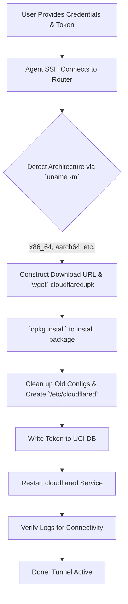

# Cloudflare Tunnel on iStoreOS Configurator

[🇨🇳 简体中文](README_zh.md) | [🇺🇸 English](README.md)

Simplify and automate the process of setting up **Cloudflare Tunnel (cloudflared)** on iStoreOS or OpenWRT routers. This package contains an AI agent skill that can handle zero-trust deployment from start to finish, **including downloading and installing the required packages automatically.**

## Automation Workflow



## What is this?
Often, users want to deploy the `cloudflared` extension on OpenWRT/iStoreOS but struggle with finding the right architecture package (`.ipk`), command-line setup, SSL validation issues, or UCI configuration. This skill (designed for AI agents like Antigravity/Cursor/Devin) allows the AI to automatically SSH into the router, **detect the architecture, download the latest compatible `cloudflared.ipk`, install it**, configure the CF Tunnel token, and establish the remote connection.

## Configured Files & Paths

This skill modifies the core OpenWRT configuration system (UCI). Below are the specific files interacted with:

### 1. `/etc/config/cloudflared`
This is the main OpenWRT configuration file managed by UCI. When the agent runs `uci set ...`, it writes the user's token directly here.

**Generated Content Example:**
```text
config cloudflared 'config'
        option enabled '1'              # Automatically set by Agent to start on boot
        option token 'eyJhIjoi...'      # The Token provided by the user
        option config '/etc/cloudflared/config.yml'
        option origincert '/etc/cloudflared/cert.pem'
        option protocol 'http2'
        option loglevel 'info'
        option logfile '/var/log/cloudflared.log'
```

### 2. `/var/log/cloudflared.log`
The agent creates and constantly monitors this log file to verify that the tunnel connection has successfully reached the Cloudflare Edge network (looking for `Registered tunnel connection`).

## How to use

### For Agent Workflows (`SKILL.md`)
If you are using an AI agent (e.g., Antigravity), you can import the `SKILL.md` file into your agent's skill directory. Once imported, you can simply ask your agent:

> *"Install my cloudflare tunnel on my iStoreOS router at 192.168.1.1. My token is eyJh..."*

The agent will read the `SKILL.md` instructions, detect the architecture, dynamically download the package from the OpenWRT releases server, install it via `opkg`, and execute the configuration steps automatically.

### Manual Setup
If you prefer to configure this manually on your iStoreOS router via SSH:

1. SSH into your router: `ssh root@192.168.x.x`
2. Determine your architecture and download the right `cloudflared` `.ipk`:
   ```bash
   uname -m # (e.g., outputs x86_64)
   
   cd /tmp
   # Example: Download package suitable for x86_64
   wget https://downloads.openwrt.org/releases/24.10.5/packages/x86_64/packages/cloudflared_2025.5.0-r1_x86_64.ipk
   
   # Install the ipk
   opkg install cloudflared_2025.5.0-r1_x86_64.ipk
   ```
3. Run the following commands, replacing `YOUR_TOKEN_HERE` with your actual Cloudflare Tunnel token:

```bash
# Clean previous state and explicitly recreate the config folder
/etc/init.d/cloudflared stop
rm -rf /etc/config/cloudflared /etc/cloudflared
mkdir -p /etc/cloudflared

# Write UCI config
uci set cloudflared.config.token='YOUR_TOKEN_HERE'
uci set cloudflared.config.enabled='1'
uci commit cloudflared

# Enable and start
/etc/init.d/cloudflared enable
/etc/init.d/cloudflared restart
```

4. Check if the tunnel is running successfully:
```bash
tail -n 20 /var/log/cloudflared.log
```

## License
MIT License
