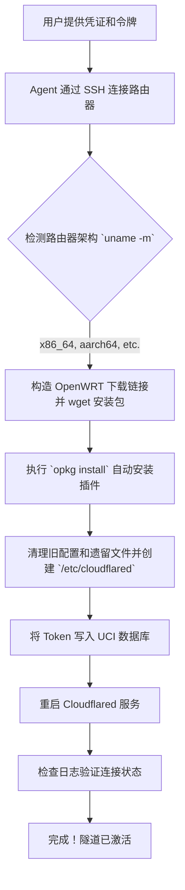

# iStoreOS 上的 Cloudflare Tunnel 自动化配置器

[🇨🇳 简体中文](README_zh.md) | [🇺🇸 English](README.md)

简化和完全自动化在 **iStoreOS** 或 **OpenWRT** 路由器上设置 **Cloudflare Tunnel (cloudflared)** 的过程。此包包含一个 AI 智能体（Agent）技能，可以全程处理零信任部署，**包括自动检测架构、下载源包和安装所需的环境。**

## 自动化执行流程图



## 这是什么？
用户经常希望在 OpenWRT/iStoreOS 上部署 `cloudflared` 扩展，但在查找正确的架构包 (`.ipk`)、命令行设置、SSL 验证问题或 UCI 配置方面遇到困难。此技能（专为 Antigravity/Cursor/Devin 等 AI Agent 设计）允许 AI 自动 SSH 连接到路由器，**通过 `uname -m` 自动检测硬件架构，构造对应的 `downloads.openwrt.org` 地址并下载兼容的 `cloudflared.ipk` 包，然后使用 `opkg` 进行安装**。装完之后直接配置 CF Tunnel 令牌，建立远程隧道的穿透连接，全程实现无人值守。

## 配置文件详解

该技能会修改 OpenWRT 的核心配置系统 (UCI)。以下是交互的特定文件：

### 1. `/etc/config/cloudflared`
这是由 UCI 管理的 OpenWRT 主配置文件。当 Agent 运行 `uci set ...` 时，它会将用户的口令直接写入此处。

**生成的文件内容示例:**
```text
config cloudflared 'config'
        option enabled '1'              # 由 Agent 自动设置为开机自启
        option token 'eyJhIjoi...'      # 用户提供的 Token
        option config '/etc/cloudflared/config.yml'
        option origincert '/etc/cloudflared/cert.pem'
        option protocol 'http2'
        option loglevel 'info'
        option logfile '/var/log/cloudflared.log'
```

### 2. `/var/log/cloudflared.log`
Agent 会监控此日志文件，以验证隧道连接是否成功到达 Cloudflare 边缘网络（寻找 `Registered tunnel connection`）。

## 如何使用

### 用于 Agent 工作流 (`SKILL.md`)
如果你使用的是 AI Agent（例如 Antigravity），你可以将 `SKILL.md` 文件导入到 Agent 的技能目录中。导入后，你只需对 Agent 说：

> *"把我的 Cloudflare Tunnel 安装在 192.168.1.1 的 iStoreOS 路由器上，我的 Token 是 eyJh..."*

Agent 会读取 `SKILL.md` 中的说明，自动检测 CPU 架构、并凭借特定逻辑动态寻找 `.ipk` 下载链接通过 `wget` 将软件包下载到 `/tmp`，使用 `opkg` 完成全部安装及配置下发步骤。

### 手动设置
如果您喜欢通过 SSH 在您的 iStoreOS 路由器上手动配置此设置：

1. 通过 SSH 连接到您的路由器: `ssh root@192.168.x.x`
2. 确定你的架构，并下载对应的 `cloudflared` 的 `.ipk` 文件:
   ```bash
   uname -m # (例如输出 x86_64)

   cd /tmp
   # 示例：通过 wget 下载适合 x86_64 架构的包 （版本号请根据实际替换）
   wget https://downloads.openwrt.org/releases/24.10.5/packages/x86_64/packages/cloudflared_2025.5.0-r1_x86_64.ipk
   
   # 执行安装
   opkg install cloudflared_2025.5.0-r1_x86_64.ipk
   ```
3. 运行以下命令，将 `YOUR_TOKEN_HERE` 替换为实际的 CF Token：

```bash
# 清理以前的配置缓存，重建工作目录
/etc/init.d/cloudflared stop
rm -rf /etc/config/cloudflared /etc/cloudflared
mkdir -p /etc/cloudflared

# 写入 UCI 节点
uci set cloudflared.config.token='YOUR_TOKEN_HERE'
uci set cloudflared.config.enabled='1'
uci commit cloudflared

# 启动并重启服务使其生效
/etc/init.d/cloudflared enable
/etc/init.d/cloudflared restart
```

4. 检查隧道是否成功运行:
```bash
tail -n 20 /var/log/cloudflared.log
```

## 许可证 (License)
MIT License
