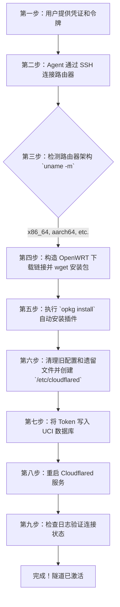

# iStoreOS 上的 Cloudflare Tunnel 自动化配置器

[🇨🇳 简体中文](README_zh.md) | [🇺🇸 English](README.md)

简化和完全自动化在 **iStoreOS** 或 **OpenWRT** 路由器上设置 **Cloudflare Tunnel (cloudflared)** 的过程。此包包含一个 AI 智能体（Agent）技能，可以全程处理零信任部署，**包括自动检测架构、下载源包和安装所需的环境。**

> **标签 / Topics:** `cloudflare-tunnel`, `istoreos`, `openwrt`, `ai-agent`, `skill`, `zero-trust`, `automation`, `cursor-rules`, `skillsmp`, `cloudflared`

## 自动化执行流程图



## 详细执行步骤

本仓库被设计为无论由运行 `SKILL.md` 的 AI 代理 (例如 Cursor / Antigravity)，还是通过手动执行 Bash 命令的人类来执行流程，都能达到相同且可预测的结果：

### 第一步 / 第二步：获取凭据并连接 SSH
您需要提供路由器的 IP (`192.168.1.1`)、SSH 用户名/密码，以及您的 Cloudflare Tunnel Token（CF 令牌，例如 `eyJh...`）。Agent 将使用 SSH (`ssh root@ip`) 登录您的 OpenWRT / iStoreOS 路由器。

### 第三步：架构检测
执行脚本或智能体将通过运行 `uname -m` 命令来查明准确的 CPU 硬件架构 (例如 `x86_64` 或 `aarch64`)，以便下载对应的二进制插件文件。

### 第四步 / 第五步：下载与安装包
程序会为 `downloads.openwrt.org` 下载服务器构造精准的地址链接。使用 `wget` 将 `.ipk` 后缀的包下载到临时文件夹 `/tmp`，随后通过 `opkg` 运行安装。
```bash
cd /tmp
# 这里的架构名称和版本，Agent 会根据上一步的返回自动填入：
wget https://downloads.openwrt.org/releases/24.10.5/packages/x86_64/packages/cloudflared_2025.5.0-r1_x86_64.ipk
opkg install cloudflared_2025.5.0-r1_x86_64.ipk
```

### 第六步：清理运行环境
为了避免遗留配置导致的冲突，脚本会停止当前服务，清除掉旧有配置文件，并显式重建需要的环境配置目录（`/etc/cloudflared`）。
```bash
/etc/init.d/cloudflared stop
rm -rf /etc/config/cloudflared /etc/cloudflared
mkdir -p /etc/cloudflared
```

### 第七步：通过 UCI 写入 Token 
OpenWRT 依赖 Unified Configuration Interface (UCI) 接口机制运作。用户的 Token 令牌会被直接以键值形式注入进数据库中。
```bash
# `YOUR_TOKEN_HERE` 实际执行时会被您的对应令牌自动替换
uci set cloudflared.config.token='YOUR_TOKEN_HERE'
uci set cloudflared.config.enabled='1'
uci commit cloudflared
```

### 第八步：重启以应用服务 
配置设置自启动参数，并重启守护程序重新应用新写入的配置。
```bash
/etc/init.d/cloudflared enable
/etc/init.d/cloudflared restart
```

### 第九步：验证网络连通性日志
代理将去监控 `/var/log/cloudflared.log` 日志输出，从而为您证明：插件连结 Cloudflare 边缘网络的请求已被正式接受 (`Registered tunnel connection`)。
```bash
tail -n 20 /var/log/cloudflared.log
```

## 如何使用

### 用于 Agent 工作流 (`SKILL.md`)
只需要向您的个人 AI 助手或编程框架中导入 `SKILL.md` 的说明文件即可：
> *"把我的 Cloudflare Tunnel 安装在 192.168.1.1 的 iStoreOS 路由器上，我的 Token 是 eyJh..."*

AI 将完美全自动化代劳处理第一步至第九步。

### 手动设置 
如果您更喜欢通过终端进行，请只需在路由器的 SSH 终端中按顺序手工执行**第四至第九步**中的 Bash 代码段。

## 许可证 (License)
MIT License
