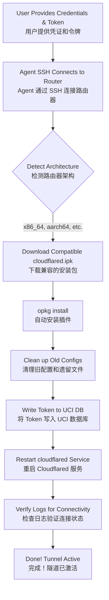

# Cloudflare Tunnel on iStoreOS Configurator (iStoreOS 上的 Cloudflare Tunnel 自动化配置器)

Simplify and automate the process of setting up **Cloudflare Tunnel (cloudflared)** on iStoreOS or OpenWRT routers. This package contains an AI agent skill that can handle zero-trust deployment from start to finish, **including downloading installing the required packages automatically.**

简化和完全自动化在 **iStoreOS** 或 **OpenWRT** 路由器上设置 **Cloudflare Tunnel (cloudflared)** 的过程。此包包含一个 AI 智能体（Agent）技能，可以全程处理零信任部署，**包括自动下载和安装所需的软件包。**

## Automation Workflow (自动化执行流程图)


## Configured Files & Paths (配置文件详解)
This skill modifies the core OpenWRT configuration system (UCI). Below are the specific files interacted with:
该技能会修改 OpenWRT 的核心配置系统 (UCI)。以下是交互的特定文件：

### 1. `/etc/config/cloudflared`
This is the main OpenWRT configuration file managed by UCI. When the agent runs `uci set ...`, it writes the user's token directly here.
这是由 UCI 管理的 OpenWRT 主配置文件。当 Agent 运行 `uci set ...` 时，它会将用户的口令直接写入此处。

**Generated Content Example (生成的文件内容示例):**
```text
config cloudflared 'config'
        option enabled '1'              # Automatically set by Agent to start on boot
        option token 'eyJhIjoi...'      # The Token provided by the user
        option config '/etc/cloudflared/config.yml'
        option origincert '/etc/cloudflared/cert.pem'
        option protocol 'http2'
        option loglevel 'info'
        option logfile '/var/log/cloudflared.log'
```

### 2. `/var/log/cloudflared.log`
The agent creates and constantly monitors this log file to verify that the tunnel connection has successfully reached the Cloudflare Edge network (looking for `Registered tunnel connection`).
Agent 会监控此日志文件，以验证隧道连接是否成功到达 Cloudflare 边缘网络。

## Prerequisites (前提条件)
- **Router IP & Credentials (路由器 IP 和凭据):** The agent needs SSH access to the iStoreOS router (typically `root` at `192.168.x.x` or similar). (Agent 需要 SSH 访问 iStoreOS 路由器，通常是 `192.168.x.x` 的 `root` 用户。)
- **Cloudflare Tunnel Token (隧道令牌):** A valid token from the Cloudflare Zero Trust dashboard. (来自 Cloudflare Zero Trust 仪表板的有效令牌。)

## Execution Steps (执行步骤)

When a user requests to configure Cloudflare Tunnel on their iStoreOS router, follow these steps strictly to ensure full automation:
当用户请求在其 iStoreOS 路由器上配置 Cloudflare Tunnel 时，请严格按照以下步骤操作以确保全自动化：

1. **Connect via SSH (通过 SSH 连接):**
   - Use the `run_command` and `send_command_input` tools to SSH into the router using the provided IP, username, and password. (使用 `run_command` 和 `send_command_input` 工具，利用提供的 IP、用户名和密码 SSH 进入路由器。)
   - Wait for the shell prompt. (等待 Shell 提示符出现。)

2. **Check Architecture & Download Cloudflared (检查架构并下载 Cloudflared):**
   - Determine the router's architecture (usually x86_64 or aarch64) and find the latest compatible `cloudflared` `.ipk` package from official or community OpenWRT/iStoreOS repositories. (确定路由器的架构，通常是 x86_64 或 aarch64，并从官方或社区的 OpenWRT/iStoreOS 软件仓库找到最新的兼容 `cloudflared` `.ipk` 安装包。)
   - If a specific version is not requested, use `wget` or `curl` on the router to download the appropriate `.ipk` directly into `/tmp`. (如果没有要求特定版本，请在路由器上使用 `wget` 或 `curl` 将合适的 `.ipk` 直接下载到 `/tmp` 目录。)

3. **Install the Package (安装软件包):**
   - Run `opkg install /tmp/cloudflared_*.ipk` to install the package. (运行 `opkg install /tmp/cloudflared_*.ipk` 安装该软件包。)

4. **Clean Up Previous Configurations (清理之前的配置):**
   - In case of a reinstall, clear old states. (如果是重新安装，请清除旧状态。)
   ```sh
   /etc/init.d/cloudflared stop
   rm -rf /etc/config/cloudflared
   rm -rf /etc/cloudflared
   rm -f /var/log/cloudflared.log
   ```

5. **Apply New Configuration via UCI (通过 UCI 应用新配置):**
   - Configure the token and enable the service using UCI (Unified Configuration Interface): (使用 UCI 配置令牌并启用服务：)
   ```sh
   # Agent: Replace YOUR_CF_TUNNEL_TOKEN with the actual token provided by user.
   uci set cloudflared.config.token='YOUR_CF_TUNNEL_TOKEN'
   uci set cloudflared.config.enabled='1'
   uci commit cloudflared
   ```

6. **Start the Service (启动服务):**
   - Restart the service to apply the configuration. (重启服务以应用配置。)
   ```sh
   /etc/init.d/cloudflared enable
   /etc/init.d/cloudflared restart
   /etc/init.d/cloudflared status
   ```

7. **Verify Logs (验证日志):**
   - Check the logs to ensure the tunnel successfully established a connection with Cloudflare's edge servers. (检查日志以确保隧道成功与 Cloudflare 的边缘服务器建立连接。)
   ```sh
   tail -n 20 /var/log/cloudflared.log
   ```

## Troubleshooting (故障排除)
- **HTTP 503 Errors (503错误):** If mapped domains return a 503 error but local access is fine (HTTP 200), advise the user to check their Cloudflare Zero Trust dashboard: (如果映射的域名返回 503 错误但本地访问正常，请建议用户检查其 Cloudflare Zero Trust 仪表板：)
  - Go to the Public Hostname configuration -> **Additional application settings** -> **TLS**. (转到 Public Hostname 配置 -> Additional application settings -> TLS。)
  - Enable **No TLS Verify**. (启用 **No TLS Verify**。这经常发生，因为 OpenWRT 本地 Web 界面通常没有受信任的 SSL 证书。)
- **Package Installation Fails (安装包失败):** If `opkg install` fails due to architecture mismatches, verify `uname -m` and download the correct `.ipk`. (如果由于架构不匹配导致 `opkg install` 失败，请验证 `uname -m` 并下载正确的 `.ipk`。)
